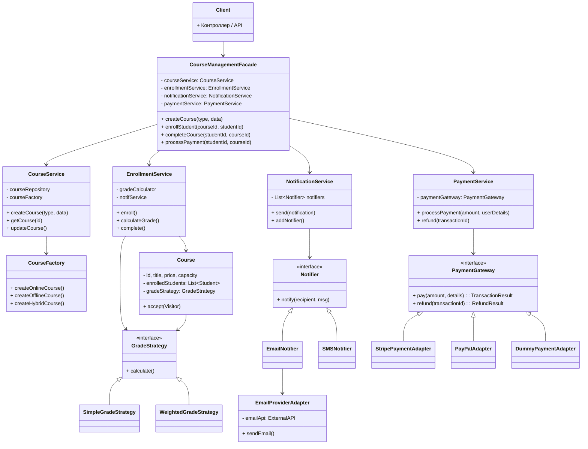

# Задание 1. Архитектурная реорганизация системы управления онлайн-курсами

## 1. Краткий анализ исходной системы

В текущей реализации ```CourseManager``` присутствуют все перечисленные проблемы:

Сосредоточение разнородных обязанностей
Создание курсов через условные операторы
Жесткая фиксация алгоритма расчета оценки
Уведомления встроены в бизнес-логику
Прямая работа с внешним API платежей
Дублирование логики

Ключевые антипаттерны:

- ```God Object``` — CourseManager делает всё

- ```Tight Coupling``` — жесткая привязка к конкретным реализациям

- ```Hard-coded Logic``` — алгоритмы зафиксированы в коде


## 2. Диаграмма классов (UML)




## 3. Описание основных классов и их ответственности

| Класс/Интерфейс | Ответственность |
| :--- | :--- |
| **CourseManagementFacade** | Единая точка входа, фасад для клиентов, делегирование операций сервисам |
| **CourseService** | Управление CRUD операциями с курсами, делегирует создание фабрике |
| **CourseFactory** (Abstract Factory) | Создание семейства связанных объектов (курс + его специфичная стратегия оценки) |
| **EnrollmentService** | Логика зачисления, завершения курсов, делегирует расчет оценки стратегии |
| **GradeStrategy** (интерфейс) | Абстракция алгоритма расчета оценки |
| **NotificationService** | Управление рассылкой, поддерживает динамическое добавление каналов |
| **Notifier** (интерфейс) | Абстракция канала уведомлений |
| **EmailProviderAdapter** | Адаптер для внешнего email-сервиса |
| **PaymentService** | Изолированная работа с платежами |
| **PaymentGateway** (интерфейс) | Абстракция платежной системы |
| **Course** | Чистая доменная сущность, содержит бизнес-данные |

## 4. Таблица решений

| Проблема | Решение | Используемый паттерн | Обоснование |
| :--- | :--- | :--- | :--- |
| God Object — все обязанности в одном классе | Разделение на фасад и профильные сервисы (CourseService, EnrollmentService, NotificationService, PaymentService) | **Facade** | Предоставляет упрощенный интерфейс для сложной подсистемы. Клиент работает только с фасадом, не видя внутренней структуры сервисов |
| Создание курсов через if/else и прямые вызовы конструкторов | Выделение отдельной фабрики, которая создает курсы и связывает их с соответствующими стратегиями | **Abstract Factory** | Позволяет создавать семейства связанных объектов (OnlineCourse + SimpleGradeStrategy) без указания конкретных классов. Добавление нового типа курса → новая конкретная фабрика, существующий код не меняется (OCP) |
| Алгоритм расчета оценки жестко зафиксирован в методе | Вынос алгоритма в отдельные классы стратегий, которые можно подставлять динамически | **Strategy** | Позволяет изменять поведение (алгоритм расчета оценки) во время выполнения. Разные курсы могут использовать разные стратегии. Добавление новой стратегии не требует изменения EnrollmentService |
| Уведомления встроены в бизнес-логику (sendEmail() внутри методов) | Абстракция через интерфейс Notifier. Бизнес-логика вызывает NotificationService.send(), который обходит список уведомителей | **Observer** (вариация: Publisher-Subscriber) | Позволяет динамически добавлять/удалять каналы уведомлений (Email, SMS, Push). Бизнес-логика не зависит от конкретных способов отправки. Новый канал → реализует Notifier и регистрируется |
| Прямая работа с внешним API платежей | Введение интерфейса PaymentGateway и адаптеров для каждой внешней системы | **Adapter** | Преобразует интерфейс внешней платежной системы (Stripe, PayPal) к единому интерфейсу PaymentGateway. При смене провайдера создается новый адаптер, остальной код не меняется |
| Дублирование логики в разных методах CourseManager | Выделение общих операций в отдельные сервисы и переиспользование через композицию | **DRY + Facade + Dependency Injection** | Логика зачисления, проверки, уведомлений теперь в одном месте. Фасад координирует сервисы без дублирования. Dependency Injection обеспечивает гибкую сборку |

## 5. Соответствие принципам

| Принцип | Как соблюден |
| :--- | :--- |
| **Single Responsibility** | Каждый класс имеет одну причину для изменения: CourseService — управление курсами, EnrollmentService — зачисления, NotificationService — уведомления, PaymentService — платежи |
| **Open/Closed** | Добавление нового типа курса → новая фабрика. Новая стратегия оценки → новый класс GradeStrategy. Новый канал уведомлений → новая реализация Notifier. Код фасада и сервисов закрыт для модификации |
| **Dependency Inversion** | Сервисы зависят от абстракций (CourseFactory, GradeStrategy, Notifier, PaymentGateway), а не от конкретных реализаций |
| **DRY** | Логика расчета оценки, отправки уведомлений, обработки платежей находится в единственном месте |
| **KISS** | Фасад предоставляет простой API, сложность инкапсулирована внутри сервисов. Каждый паттерн применен ровно для решения конкретной проблемы, без over-engineering |

## 6. Краткий вывод

Предложенная архитектура устраняет все выявленные проблемы путем:

1. Разделения ответственности — вместо одного CourseManager созданы специализированные сервисы, координируемые фасадом.

2. Инкапсуляции создания объектов — Abstract Factory изолирует порождение курсов.

3. Динамической смены алгоритмов — Strategy позволяет гибко настраивать расчет оценки.

4. Ослабления связей с внешними сервисами — Adapter для email и платежей обеспечивает заменяемость.

5. Децентрализации уведомлений — Observer-подобная регистрация каналов.

Использованные паттерны:

✅ Facade — единая точка входа

✅ Abstract Factory — создание семейств объектов

✅ Strategy — алгоритмы расчета оценки

✅ Adapter — интеграция с внешними платежными и email-системами

✅ Observer — для уведомлений

Архитектура соответствует принципам SOLID, DRY, KISS и готова к расширению: добавление нового типа курса, платежного шлюза или канала уведомлений не требует изменения существующей бизнес-логики.