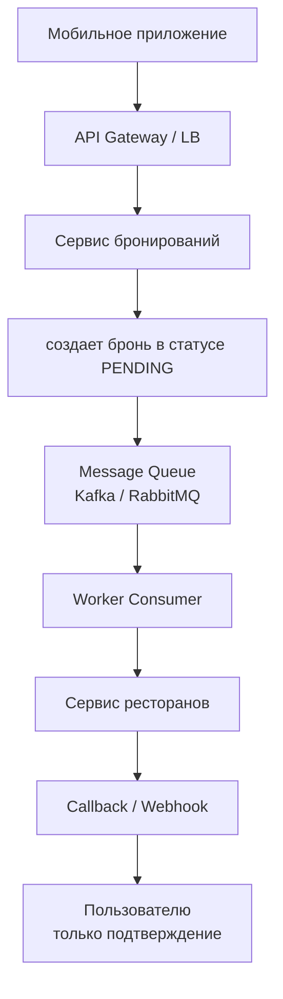
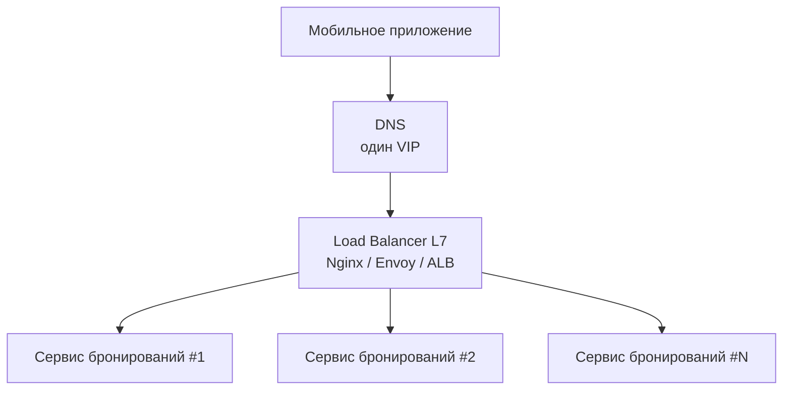
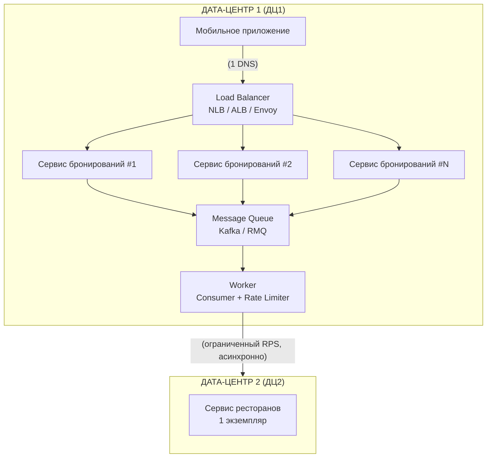

# Задание 2. Анализ архитектуры системы бронирования столиков

## 1. Центральные проблемы архитектуры

| Проблема | Суть | Классификация |
| :--- | :--- | :--- |
| Синхронная связанность с критическим upstream-сервисом | Сервис бронирований синхронно вызывает сервис ресторанов при каждом запросе. При пиковой нагрузке (50 000 RPS) единственный экземпляр сервиса ресторанов перегружается, вызывая таймауты, ошибки и каскадный отказ сервиса бронирований | Architectural: Tight coupling, Lack of bulkheading |
| Неравномерное распределение нагрузки между экземплярами сервиса бронирований | Мобильное приложение всегда начинает со списка IP в фиксированном порядке. При пике все 50 000 RPS идут сначала на первый экземпляр → он падает → затем на второй и т.д. (эффект "толпы") | Architectural: Lack of proper load balancing, Cascading failure |

## 2. Детальный разбор проблем

> Проблема №1: Синхронный вызов единственного экземпляра сервиса ресторанов

Почему это проблема:

- Сервис ресторанов — single point of failure (SPOF)

- При 50 000 RPS он получает тот же поток запросов (каждое бронирование требует проверки)

- Таймауты/ошибки проваливаются обратно пользователю

- Невозможно масштабировать сервис ресторанов (ограничение: компания-вендор отказывается)

- Синхронность создает прямую зависимость времени отклика и доступности

Классический антипаттерн: ```"Synchronous Distributed System"``` — в распределенных системах синхронные цепочки вызовов экспоненциально увеличивают риск отказа.

> Проблема №2: Фиксированный порядок IP в клиенте - неравномерная нагрузка

Эффект при 50 000 RPS:

- Все 50 000 запросов идут на addresses[0] - экземпляр #1 падает

- Все приложения переключаются на addresses[1] - экземпляр #2 падает

- Каскадное падение всех экземпляров сервиса бронирований

- При полном падении цикл повторяется (последний - первый уже мертв)

Почему это проблема:

- ```No load balancing``` — все запросы направляются на один экземпляр до его отказа

- ```No health checking``` — приложение не знает о нагрузке, только о доступности (бинарное состояние)

- ```No randomization``` — детерминированный порядок у всех клиентов создает "эффект стада"

- ```Cascading failure``` — отказ одного экземпляра убивает следующий по очереди

## 3. Решения

### Решение для проблемы №1: Асинхронная обработка бронирований

> #### Ключевая идея: Перевести синхронное взаимодействие с сервисом ресторанов в асинхронное с буферизацией запросов и ретраями.

Изменение архитектуры:



Что именно меняется:

#### 1. Сервис бронирований при запросе не вызывает сервис ресторанов синхронно

- Создает запись бронирования в статусе PENDING

- Отправляет событие BookingRequested в очередь

- Возвращает пользователю 202 Accepted + bookingId

#### 2. Воркер (новый компонент) асинхронно читает из очереди

- Вызывает сервис ресторанов с ограничением скорости (rate limiting)

- При успехе обновляет статус на CONFIRMED и уведомляет пользователя

- При ошибке делает retry с экспоненциальной задержкой (или DLQ)

#### 3. Ограничение нагрузки на сервис ресторанов

- Worker использует Token Bucket или Leaky Bucket — максимум N RPS (например, 200 RPS, что составляет 20% от мощности)

- Сервис ресторанов получает равномерный поток, как и хочет бизнес

#### Дополнительно:

- Поскольку рестораны "бесконечные", можно подтверждать брони автоматически (фактическая проверка — формальность)

- Бизнес-требование "не отвечать отказами" соблюдается — при пике пользователи получают 202 Accepted, а не ошибку

#### Используемые паттерны (Java-архитектура):

```Message Queue / Event-Driven``` — асинхронное взаимодействие

```Circuit Breaker (в воркере)``` — защита от повторных вызовов мертвого сервиса

```Backpressure / Rate Limiter (Guava RateLimiter, Resilience4j)``` — контроль нагрузки

```Outbox pattern``` — если нужна гарантия доставки бронирования

### Решение для проблемы №2: Правильное балансирование нагрузки

> #### Ключевая идея: Клиент не должен самостоятельно выбирать экземпляр сервиса бронирований детерминированно, в коде приложения не должно быть жестко прописанной логики на какой конкретный IP-адрес или экземпляр сервиса отправить запрос.

Внедрение Load Balancer на стороне сервера.



Что меняется:

- Мобильное приложение знает один адрес (например, api.restaurant.com)

- Load Balancer распределяет запросы равномерно (round-robin / least connections / random)

- Load Balancer знает о health checks и не шлет трафик на упавшие экземпляры

Почему это решает проблему:

- Нагрузка распределяется равномерно — все экземпляры сервиса бронирований получают ~50 000 / N RPS

- При отказе одного экземпляра LB перестает слать на него трафик

- Нет эффекта "толпы" — клиенты не синхронизируют выбор первого адреса

## 4. Итоговая предлагаемая архитектура



## 5. Таблица решений

| Проблема | Решение | Обоснование |
| :--- | :--- | :--- |
| Синхронный вызов сервиса ресторанов создает SPOF и каскадный отказ при пике | Асинхронная обработка через очередь сообщений + воркер с rate limiter | Устраняет прямую зависимость времени отклика. Сервис бронирований мгновенно возвращает 202 Accepted. Сервис ресторанов получает равномерную нагрузку (20% мощности) независимо от пиков. Бизнес-требование "не отвечать отказами" соблюдается, так как пользователь всегда получает подтверждение (пусть и не мгновенное, но в течение 24 часов) |
| Фиксированный порядок IP в клиенте приводит к каскадному отказу экземпляров сервиса бронирований | Единая точка входа через Load Balancer с равномерным распределением (round-robin) и health checks | Нагрузка распределяется между всеми экземплярами. Отказ одного экземпляра не убивает последующие. Клиенты знают только один VIP-адрес. Решение не требует изменения логики клиента кроме замены списка адресов на один адрес |

## 6. Дополнительные улучшения для полной надежности

```Circuit Breaker``` в воркере для сервиса ресторанов (Resilience4j)

```Dead Letter Queue (DLQ)``` для необработанных бронирований

```Retry с exponential backoff``` при временных ошибках сервиса ресторанов

```Мониторинг очереди``` — алерты при росте размера очереди > порога

```Авто-скейлинг воркеров``` в ДЦ1 в зависимости от глубины очереди

```Idempotency keys``` в бронированиях, чтобы избежать дублей при повторах

## 7. Краткий вывод

Две центральные проблемы:

- ```Синхронная связанность``` — решается асинхронным паттерном (Message Queue + Worker + Rate Limiter)

- ```Отсутствие балансировки нагрузки``` — решается внедрением Load Balancer перед экземплярами сервиса бронирований

Оба решения:

- Не требуют изменений в сервисе ресторанов (вендор не меняет свой код)

- Учитывают ограничение "нельзя добавлять экземпляры сервиса ресторанов"

- Соблюдают бизнес-требование "никаких отказов в бронировании"

- Укладываются в SLA 24 часа на обработку бронирования